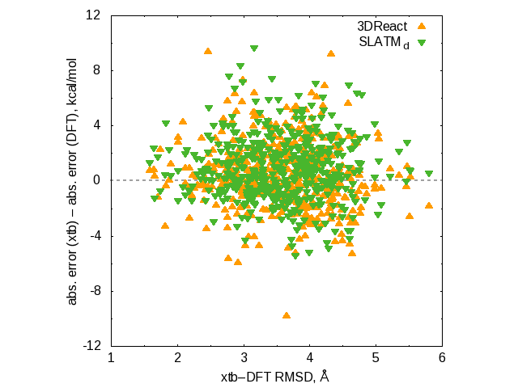

# Scripts to generate the data for the geometry sensitivity analysis

* [`1_compare_cyclo_dft_xtb.py`](1_compare_cyclo_dft_xtb.py) computes the RMSD between the DFT and xTB geometries
for the "xtb" subset of the Cyclo-23-TS dataset
using the [`rmsd`](https://github.com/charnley/rmsd) package.
  * [`rmsd.dat`](rmsd.dat) the computed RMSD.
* [`2_prepare_data.py`](2_prepare_data.py) prepares the data files for the Gnuplot script.
  * [`cyclo_3dreact_forplot.dat`](cyclo_3dreact_forplot.dat)
  * [`cyclo_slatm_forplot.dat`](cyclo_slatm_forplot.dat)
* [`rmsd.gp`](rmsd.gp): the Gnuplot script.
  * [`rmsd.png`](rmsd.png): the plot.

