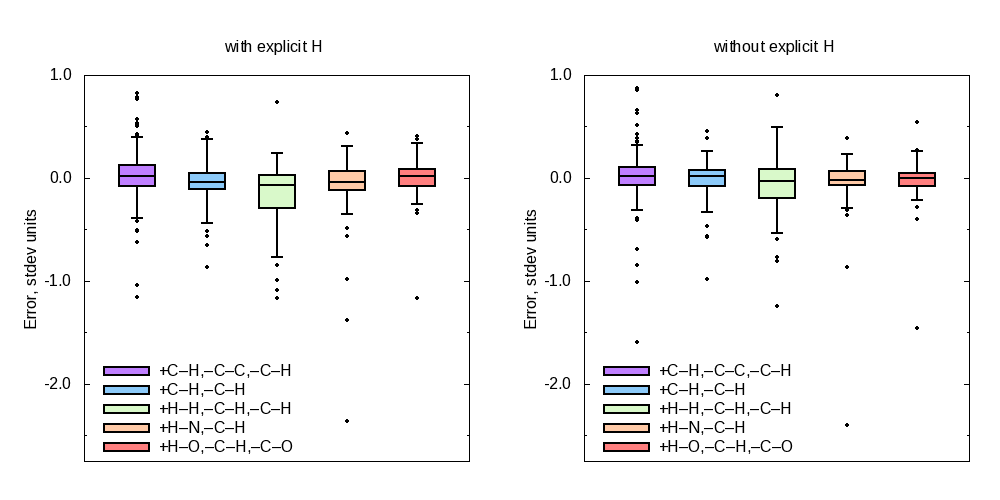

# Reaction classes of the GDB7-22-TS set

* [`1_gdb-classes.py`](1_gdb-classes.py) for each reaction determines its class based on the breaking/forming bonds.
  * [`signatures.dat`](signatures.dat) — reaction classes.
  * [`signatures-skip-H2.dat`](signatures-skip-H2.dat) — reaction classes ($\mathrm{H}_2} abstraction ignored)
* [`2_class-errors.py`](2_class-errors.py) saves the input data for the Gnuplot script.
  * [`class-errors-cv10-gdb-inv-random-noH-dft-true-ns64-nv64-d32-l2-vector-diff-both.123.dat`](class-errors-cv10-gdb-inv-random-noH-dft-true-ns64-nv64-d32-l2-vector-diff-both.123.dat)
  * [`class-errors-cv10-gdb-inv-random-withH-dft-true-ns64-nv64-d32-l2-vector-diff-both.123.dat`](class-errors-cv10-gdb-inv-random-withH-dft-true-ns64-nv64-d32-l2-vector-diff-both.123.dat)
* [`class-errors.gp`](class-errors.gp): the Gnuplot script.
  * [`class-errors.png`](class-errors.png): the plot.

* [`class-indices.py`](class-indices.py) prints class index instead of class signature.
  * [`class_indices.dat`](class_indices.dat) is used by
    [`../repr/dim-reduction.gdb.equireact.py`](../repr/dim-reduction.gdb.equireact.py)
